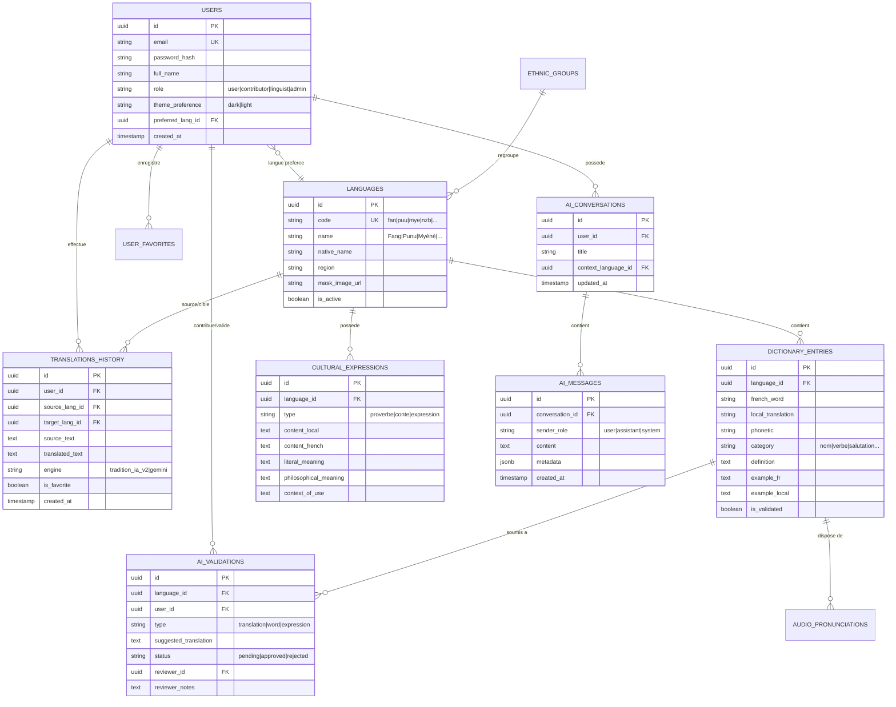

# 🏛️ TRADITION IA — ARCHITECTURE & SCHÉMA DE LA BASE DE DONNÉES

> **Projet** : Tradition IA — Plateforme d'IA & Préservation des Langues et Traditions Gabonaises  
> **Auteur** : Tradition IA Core Team  
> **Format SGBD Recommandé** : **PostgreSQL 15+** (ou **Supabase**) / Compatible MySQL 8+  
> **Fichier SQL prêt à exécuter** : [`database_schema.sql`](file:///c:/Users/Rosny%20Minlo/Desktop/Tradition%20IA/database_schema.sql)

---

## 📑 TABLE DES MATIÈRES
1. [Vue d'ensemble & Architecture Globale](#1-vue-densemble--architecture-globale)
2. [Diagramme Entité-Relation (ERD Mermaid)](#2-diagramme-entité-relation-erd-mermaid)
3. [Détail des Tables & Colonnes](#3-détail-des-tables--colonnes)
   - 3.1. Gestion des Utilisateurs & Authentification (`users`, `user_sessions`)
   - 3.2. Langues Gabonaises & Groupes Ethniques (`ethnic_groups`, `languages`)
   - 3.3. Dictionnaire & Prononciations Audio (`dictionary_entries`, `audio_pronunciations`)
   - 3.4. Expressions, Proverbes & Contes (`cultural_expressions`)
   - 3.5. Historique & Moteur de Traduction (`translations_history`)
   - 3.6. Assistant IA & Conversations (`ai_conversations`, `ai_messages`)
   - 3.7. Validation IA & Contribution Communautaire (`ai_validations`)
   - 3.8. Favoris Utilisateurs (`user_favorites`)
   - 3.9. Analytics & Paramètres Système (`analytics_events`, `system_settings`)
4. [Déroulement Pas à Pas (Guide de Déploiement)](#4-déroulement-pas-à-pas-guide-de-déploiement)
5. [Script d'Initialisation des Données (Seeding)](#5-script-dinitialisation-des-données-seeding)

---

## 1. Vue d'ensemble & Architecture Globale

La base de données de **Tradition IA** est structurée en **4 pôles majeurs** :

```
┌────────────────────────────────────────────────────────────────────────┐
│                        TRADITION IA DATABASE                           │
├───────────────────┬───────────────────┬────────────────────────────────┤
│ 👤 UTILISATEURS   │ 🌍 PATRIMOINE     │ 🤖 IA & TRADUCTION             │
│ • users           │ • ethnic_groups   │ • translations_history         │
│ • user_sessions   │ • languages       │ • ai_conversations             │
│ • user_favorites  │ • dictionary      │ • ai_messages                  │
│                   │ • audio_recordings│ • ai_validations               │
│                   │ • expressions     │ • analytics_events             │
└───────────────────┴───────────────────┴────────────────────────────────┘
```

---

## 2. Diagramme Entité-Relation (ERD Mermaid)



---

## 3. Détail des Tables & Colonnes

### 3.1. Utilisateurs & Authentification

#### Table `users`
Stocke les comptes utilisateurs, rôles (Admin, Linguiste, Contributeur, Visiteur) et préférences.

| Colonne | Type | Contraintes | Description |
| :--- | :--- | :--- | :--- |
| `id` | `UUID` | `PRIMARY KEY, DEFAULT gen_random_uuid()` | Identifiant unique de l'utilisateur |
| `email` | `VARCHAR(255)` | `UNIQUE, NOT NULL` | Adresse email de connexion |
| `password_hash` | `VARCHAR(255)` | `NOT NULL` | Mot de passe chiffré (Bcrypt / Argon2) |
| `full_name` | `VARCHAR(120)` | `NOT NULL` | Nom et prénom |
| `avatar_url` | `VARCHAR(500)` | `NULL` | Photo de profil ou avatar masque |
| `role` | `VARCHAR(20)` | `DEFAULT 'user'` | `'user'`, `'contributor'`, `'linguist'`, `'admin'` |
| `preferred_lang_id`| `UUID` | `REFERENCES languages(id)` | Langue gabonaise favorite par défaut |
| `theme_preference` | `VARCHAR(10)` | `DEFAULT 'dark'` | `'dark'` ou `'light'` |
| `is_verified` | `BOOLEAN` | `DEFAULT FALSE` | Email validé |
| `api_key` | `VARCHAR(64)` | `UNIQUE, NULL` | Clé d'accès API développeur |
| `daily_quota` | `INT` | `DEFAULT 50` | Limite journalière de requêtes IA |
| `created_at` | `TIMESTAMPTZ` | `DEFAULT NOW()` | Date d'inscription |
| `last_login_at` | `TIMESTAMPTZ` | `NULL` | Dernier accès |

---

### 3.2. Langues Gabonaises & Groupes Ethniques

#### Table `ethnic_groups`
Représente les 9 provinces et ethnies du Gabon associées aux traditions.

| Colonne | Type | Contraintes | Description |
| :--- | :--- | :--- | :--- |
| `id` | `UUID` | `PRIMARY KEY, DEFAULT gen_random_uuid()` | Identifiant unique |
| `name` | `VARCHAR(80)` | `NOT NULL, UNIQUE` | Nom de l'ethnie (Fang, Punu, Nzébi, Kota...) |
| `region` | `VARCHAR(150)` | `NOT NULL` | Provinces d'origine au Gabon |
| `cultural_summary`| `TEXT` | `NULL` | Histoire, traditions, rites (Bwiti, Mwiri, Ndjembe) |
| `mask_name` | `VARCHAR(100)` | `NOT NULL` | Nom du masque (ex: Ngil, Mukudj, Bwete) |
| `mask_image_url` | `VARCHAR(255)` | `NOT NULL` | Chemin image PNG transparent (ex: `images/fang.png`) |

#### Table `languages`
Catalogue des langues vivantes intégrées au moteur de traduction.

| Colonne | Type | Contraintes | Description |
| :--- | :--- | :--- | :--- |
| `id` | `UUID` | `PRIMARY KEY, DEFAULT gen_random_uuid()` | Identifiant unique |
| `ethnic_group_id` | `UUID` | `REFERENCES ethnic_groups(id)` | Lien vers le groupe ethnique |
| `code` | `VARCHAR(10)` | `NOT NULL, UNIQUE` | Code court : `fan`, `puu`, `mye`, `nzb`, `tek`, etc. |
| `name` | `VARCHAR(80)` | `NOT NULL` | Nom français : Fang, Punu, Myènè, Nzébi, Téké, etc. |
| `native_name` | `VARCHAR(100)` | `NOT NULL` | Nom vernaculaire : Fang-Beti, Yipunu, Omyènè, Inzébi |
| `family` | `VARCHAR(100)` | `DEFAULT 'Bantoue'` | Branche linguistique (ex: Bantoue Nord-Ouest) |
| `speakers_estimate`| `VARCHAR(50)` | `NULL` | Nombre approximatif de locuteurs (ex: ~800 000) |
| `tonal_system` | `TEXT` | `NULL` | Règles tonales (tons Haut, Bas, Modulé) |
| `grammar_rules` | `TEXT` | `NULL` | Préfixes de classes nominales, conjugaisons |
| `mask_image_url` | `VARCHAR(255)` | `NOT NULL` | URL du masque pour l'UI |
| `is_active` | `BOOLEAN` | `DEFAULT TRUE` | Disponible pour la traduction |
| `display_order` | `INT` | `DEFAULT 0` | Ordre d'affichage dans les sélecteurs |

---

### 3.3. Dictionnaire & Prononciations Audio

#### Table `dictionary_entries`
Lexique complet enrichi de chaque langue.

| Colonne | Type | Contraintes | Description |
| :--- | :--- | :--- | :--- |
| `id` | `UUID` | `PRIMARY KEY, DEFAULT gen_random_uuid()` | Identifiant du mot |
| `language_id` | `UUID` | `REFERENCES languages(id), NOT NULL` | Langue du mot |
| `french_word` | `VARCHAR(150)` | `NOT NULL` | Mot en français (recherche) |
| `local_translation`| `VARCHAR(150)` | `NOT NULL` | Traduction en langue locale |
| `phonetic` | `VARCHAR(150)` | `NULL` | Transcription phonétique simplifiée (ex: [mbo-lo]) |
| `category` | `VARCHAR(50)` | `DEFAULT 'nom'` | Nom, Verbe, Adjectif, Salutation, Chiffre |
| `definition` | `TEXT` | `NULL` | Définition ou nuances d'usage |
| `example_fr` | `TEXT` | `NULL` | Exemple de phrase en français |
| `example_local` | `TEXT` | `NULL` | Exemple traduit dans la langue locale |
| `cultural_notes` | `TEXT` | `NULL` | Signification spirituelle ou coutumière |
| `is_validated` | `BOOLEAN` | `DEFAULT TRUE` | Validé par un comité de linguistes |
| `created_by` | `UUID` | `REFERENCES users(id)` | Auteur de la contribution |
| `created_at` | `TIMESTAMPTZ` | `DEFAULT NOW()` | Date d'ajout |

#### Table `audio_pronunciations`
Enregistrements vocaux des mots par des locuteurs natifs.

| Colonne | Type | Contraintes | Description |
| :--- | :--- | :--- | :--- |
| `id` | `UUID` | `PRIMARY KEY, DEFAULT gen_random_uuid()` | Identifiant audio |
| `dictionary_entry_id`| `UUID` | `REFERENCES dictionary_entries(id)` | Mot associé |
| `audio_url` | `VARCHAR(500)` | `NOT NULL` | Fichier MP3 / WebM (Stockage Cloud/S3) |
| `speaker_gender` | `VARCHAR(10)` | `NULL` | `'M'`, `'F'` |
| `accent_province`| `VARCHAR(80)` | `NULL` | Région du locuteur (ex: Woleu-Ntem) |
| `is_verified` | `BOOLEAN` | `DEFAULT TRUE` | Qualité vocale approuvée |

---

### 3.4. Expressions, Proverbes & Contes

#### Table `cultural_expressions`
Conservation des proverbes, contes, récits d'anciens et sagesses orales.

| Colonne | Type | Contraintes | Description |
| :--- | :--- | :--- | :--- |
| `id` | `UUID` | `PRIMARY KEY, DEFAULT gen_random_uuid()` | Identifiant |
| `language_id` | `UUID` | `REFERENCES languages(id), NOT NULL` | Langue de l'expression |
| `type` | `VARCHAR(30)` | `NOT NULL` | `'proverbe'`, `'conte'`, `'expression'`, `'salutation'` |
| `content_local` | `TEXT` | `NOT NULL` | Texte dans la langue gabonaise |
| `content_french` | `TEXT` | `NOT NULL` | Traduction française fluide |
| `literal_meaning` | `TEXT` | `NULL` | Traduction mot-à-mot |
| `philosophical_meaning`| `TEXT` | `NULL` | Sagesse, morale ou leçon philosophique |
| `context_of_use` | `TEXT` | `NULL` | Circonstance coutumière (ex: mariage, palabre, deuil) |
| `audio_url` | `VARCHAR(500)` | `NULL` | Enregistrement vocal |
| `is_validated` | `BOOLEAN` | `DEFAULT TRUE` | Validation linguistique |

---

### 3.5. Historique & Moteur de Traduction

#### Table `translations_history`
Mémorise les traductions demandées pour l'historique utilisateur et l'amélioration de l'IA.

| Colonne | Type | Contraintes | Description |
| :--- | :--- | :--- | :--- |
| `id` | `UUID` | `PRIMARY KEY, DEFAULT gen_random_uuid()` | Identifiant |
| `user_id` | `UUID` | `REFERENCES users(id), NULL` | Utilisateur (NULL si anonyme) |
| `source_lang_id` | `UUID` | `REFERENCES languages(id), NOT NULL` | Langue source |
| `target_lang_id` | `UUID` | `REFERENCES languages(id), NOT NULL` | Langue cible |
| `source_text` | `TEXT` | `NOT NULL` | Texte original saisi ou dicté |
| `translated_text`| `TEXT` | `NOT NULL` | Résultat traduit |
| `engine` | `VARCHAR(50)` | `DEFAULT 'tradition_ia_v2'` | Moteur (`'tradition_ia_v2'`, `'gemini_flash'`) |
| `confidence_score`| `DECIMAL(4,2)`| `DEFAULT 0.95` | Indice de confiance de la traduction |
| `latency_ms` | `INT` | `NULL` | Temps de réponse en ms |
| `is_favorite` | `BOOLEAN` | `DEFAULT FALSE` | Marqué comme favori |
| `created_at` | `TIMESTAMPTZ` | `DEFAULT NOW()` | Date et heure |

---

### 3.6. Assistant IA & Conversations

#### Table `ai_conversations`
Fils de discussion avec l'assistant culturel Tradition IA.

| Colonne | Type | Contraintes | Description |
| :--- | :--- | :--- | :--- |
| `id` | `UUID` | `PRIMARY KEY, DEFAULT gen_random_uuid()` | Identifiant de session de chat |
| `user_id` | `UUID` | `REFERENCES users(id), NOT NULL` | Propriétaire de la conversation |
| `title` | `VARCHAR(150)` | `DEFAULT 'Nouvelle discussion'`| Titre généré de la discussion |
| `context_language_id`| `UUID` | `REFERENCES languages(id), NULL` | Langue de prédilection de la session |
| `created_at` | `TIMESTAMPTZ` | `DEFAULT NOW()` | Date de création |
| `updated_at` | `TIMESTAMPTZ` | `DEFAULT NOW()` | Date du dernier message |

#### Table `ai_messages`
Messages individuels échangés dans les conversations.

| Colonne | Type | Contraintes | Description |
| :--- | :--- | :--- | :--- |
| `id` | `UUID` | `PRIMARY KEY, DEFAULT gen_random_uuid()` | Identifiant du message |
| `conversation_id`| `UUID` | `REFERENCES ai_conversations(id)` | Conversation parente |
| `sender_role` | `VARCHAR(20)` | `NOT NULL` | `'user'`, `'assistant'`, `'system'` |
| `content` | `TEXT` | `NOT NULL` | Texte du message en markdown |
| `cultural_references`| `JSONB` | `DEFAULT '{}'` | Citations de proverbes ou règles associées |
| `created_at` | `TIMESTAMPTZ` | `DEFAULT NOW()` | Horodatage précis |

---

### 3.7. Validation IA & Contribution Communautaire

#### Table `ai_validations`
Backoffice de relecture pour les linguistes et administrateurs.

| Colonne | Type | Contraintes | Description |
| :--- | :--- | :--- | :--- |
| `id` | `UUID` | `PRIMARY KEY, DEFAULT gen_random_uuid()` | Identifiant |
| `user_id` | `UUID` | `REFERENCES users(id), NULL` | Contributeur |
| `language_id` | `UUID` | `REFERENCES languages(id), NOT NULL` | Langue concernée |
| `source_french` | `TEXT` | `NOT NULL` | Texte en français |
| `suggested_translation`| `TEXT` | `NOT NULL` | Traduction proposée |
| `status` | `VARCHAR(20)` | `DEFAULT 'pending'` | `'pending'`, `'approved'`, `'rejected'` |
| `reviewer_id` | `UUID` | `REFERENCES users(id), NULL` | Administrateur ou linguiste ayant validé |
| `reviewer_notes` | `TEXT` | `NULL` | Motif d'acceptation ou de rejet |
| `created_at` | `TIMESTAMPTZ` | `DEFAULT NOW()` | Date de soumission |
| `reviewed_at` | `TIMESTAMPTZ` | `NULL` | Date d'évaluation |

---

### 3.8. Favoris Utilisateurs

#### Table `user_favorites`
Permet aux utilisateurs de sauvegarder leurs mots, proverbes et traductions préférés.

| Colonne | Type | Contraintes | Description |
| :--- | :--- | :--- | :--- |
| `id` | `UUID` | `PRIMARY KEY, DEFAULT gen_random_uuid()` | Identifiant |
| `user_id` | `UUID` | `REFERENCES users(id), NOT NULL` | Utilisateur |
| `item_type` | `VARCHAR(30)` | `NOT NULL` | `'translation'`, `'dictionary_word'`, `'expression'` |
| `item_id` | `UUID` | `NOT NULL` | Identifiant de l'élément cible |
| `custom_notes` | `TEXT` | `NULL` | Note personnelle de l'utilisateur |
| `created_at` | `TIMESTAMPTZ` | `DEFAULT NOW()` | Date d'ajout |

---

### 3.9. Analytics & Paramètres Système

#### Table `analytics_events`
Métriques d'utilisation pour le tableau de bord Admin Analytics.

| Colonne | Type | Contraintes | Description |
| :--- | :--- | :--- | :--- |
| `id` | `BIGSERIAL` | `PRIMARY KEY` | Numéro d'événement |
| `event_name` | `VARCHAR(50)` | `NOT NULL` | `'translate'`, `'tts_listen'`, `'voice_input'`, `'chat_query'` |
| `language_code`| `VARCHAR(10)` | `NULL` | Langue ciblée |
| `user_id` | `UUID` | `NULL` | Utilisateur (anonymisé si non connecté) |
| `duration_ms` | `INT` | `DEFAULT 0` | Temps de traitement |
| `created_at` | `TIMESTAMPTZ` | `DEFAULT NOW()` | Horodatage de l'action |

#### Table `system_settings`
Configuration globale de la plateforme modifiable depuis l'interface d'administration.

| Colonne | Type | Contraintes | Description |
| :--- | :--- | :--- | :--- |
| `setting_key` | `VARCHAR(80)` | `PRIMARY KEY` | Clé unique (ex: `maintenance_mode`, `ai_model_name`) |
| `setting_value`| `TEXT` | `NOT NULL` | Valeur (string, booléen, JSON) |
| `description` | `VARCHAR(255)` | `NULL` | Description du rôle du paramètre |
| `updated_at` | `TIMESTAMPTZ` | `DEFAULT NOW()` | Dernière mise à jour |

---

## 4. Déroulement Pas à Pas (Guide de Déploiement)

Voici les étapes méthodiques pour monter la base de données en production :

```
Étape 1 ──────► Étape 2 ──────► Étape 3 ──────► Étape 4 ──────► Étape 5
Choix du        Exécution       Seeding des     Sécurité &      Connexion API
SGBD Cloud      du Schéma DDL   Données Gabon   Index/RLS       Node.js Backend
```

### Étape 1 : Choix de la plateforme SGBD
1. **Option Recommandée** : **Supabase (PostgreSQL hébergé)**
   - Gratuit, ultra-rapide, inclut Authentification, Row Level Security et API temps réel.
2. **Alternative Cloud** : Google Cloud SQL (Postgres), Neon Tech, Render Postgres ou MySQL 8+.

### Étape 2 : Création de la base et exécution du DDL
- Ouvrez votre console SQL (pgAdmin, Supabase SQL Editor ou DBeaver).
- Exécutez le script complet fourni dans [`database_schema.sql`](file:///c:/Users/Rosny%20Minlo/Desktop/Tradition%20IA/database_schema.sql).
- Le script crée les extensions nécessaires (`pgcrypto` ou `uuid-ossp`), les 11 tables, les contraintes de clés étrangères et les index d'optimisation.

### Étape 3 : Injection du jeu de données culturel initial (Seeding)
- Les 10 langues gabonaises (Fang, Punu, Myènè, Nzébi, Téké, Vili, Obamba, Guisir, Kota, Anglais) sont insérées avec leurs masques SVG/PNG associés.
- Les proverbes, salutations courantes et vocabulaire de base issu de `api/_knowledge.js` sont automatiquement pré-remplis.

### Étape 4 : Mise en place des Index & Performances
Des index B-Tree et GIN (pour recherche de texte) sont configurés :
- Index sur `users(email)` et `users(role)`
- Index sur `dictionary_entries(french_word)` et `dictionary_entries(language_id)`
- Index sur `translations_history(user_id, created_at DESC)`
- Index sur `ai_messages(conversation_id, created_at ASC)`

### Étape 5 : Intégration dans le backend Tradition IA
- Dans votre fichier `.env` ou variables d'environnement Vercel :
```env
DATABASE_URL="postgresql://postgres:[PASSWORD]@[HOST]:5432/tradition_ia?sslmode=require"
JWT_SECRET="votre_secret_tres_securise_tradition_ia"
```
- Les endpoints `api/translate.js`, `api/chat.js` et les pages admin se connectent directement à cette base de données pour persister l'historique et les validations.

---

## 5. Script d'Initialisation des Données (Seeding)

Consultez le fichier [`database_schema.sql`](file:///c:/Users/Rosny%20Minlo/Desktop/Tradition%20IA/database_schema.sql) pour exécuter l'intégralité du code SQL prêt à l'emploi.
