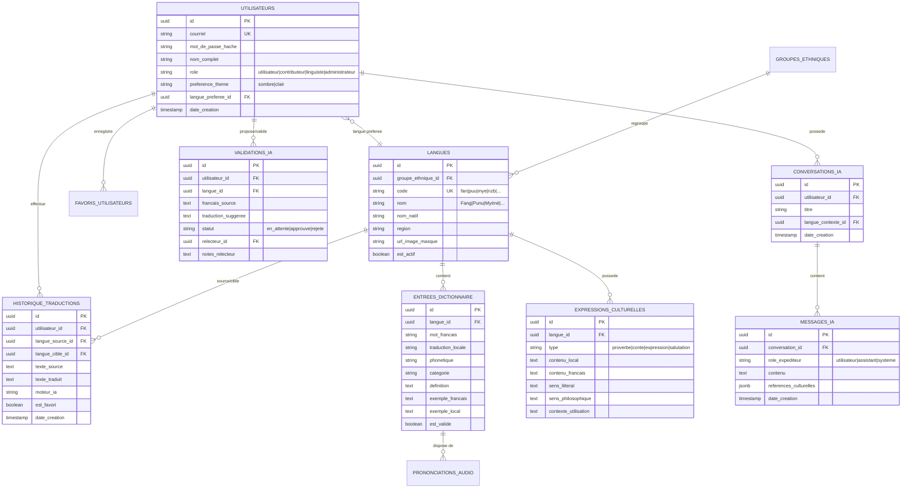

# 🏛️ TRADITION IA — ARCHITECTURE & SCHÉMA DE LA BASE DE DONNÉES (100% EN FRANÇAIS)

> **Projet** : Tradition IA — Plateforme d'IA & Préservation des Langues et Traditions Gabonaises  
> **Auteur** : Tradition IA Core Team  
> **Format SGBD Recommandé** : **PostgreSQL 14+** (ou **Supabase**) / Compatible Neon, Render, Google Cloud SQL  
> **Fichier SQL prêt à exécuter** : [`database_schema.sql`](file:///c:/Users/LENOVO/OneDrive/Desktop/Tradition-IA/database_schema.sql)  
> **Norme de nommage** : 100% en français (tables et champs)

---

## 📑 TABLE DES MATIÈRES
1. [Vue d'ensemble & Architecture Globale](#1-vue-densemble--architecture-globale)
2. [Diagramme Entité-Relation (ERD Mermaid)](#2-diagramme-entité-relation-erd-mermaid)
3. [Détail des Tables & Colonnes](#3-détail-des-tables--colonnes)
   - 3.1. [Groupes Ethniques & Langues Gabonaises (`groupes_ethniques`, `langues`)](#31-groupes-ethniques--langues-gabonaises)
   - 3.2. [Gestion des Utilisateurs & Sessions (`utilisateurs`, `sessions_utilisateurs`)](#32-gestion-des-utilisateurs--sessions)
   - 3.3. [Dictionnaire & Prononciations Audio (`entrees_dictionnaire`, `prononciations_audio`)](#33-dictionnaire--prononciations-audio)
   - 3.4. [Expressions, Proverbes & Contes (`expressions_culturelles`)](#34-expressions-proverbes--contes)
   - 3.5. [Historique des Traductions (`historique_traductions`)](#35-historique-des-traductions)
   - 3.6. [Assistant IA & Conversations (`conversations_ia`, `messages_ia`)](#36-assistant-ia--conversations)
   - 3.7. [Validation IA & Contribution Communautaire (`validations_ia`)](#37-validation-ia--contribution-communautaire)
   - 3.8. [Favoris Utilisateurs (`favoris_utilisateurs`)](#38-favoris-utilisateurs)
   - 3.9. [Statistiques & Paramètres Système (`evenements_analytiques`, `parametres_systeme`)](#39-statistiques--paramètres-système)
4. [Guide de Déploiement & Bonnes Pratiques](#4-guide-de-déploiement--bonnes-pratiques)

---

## 1. Vue d'ensemble & Architecture Globale

La base de données de **Tradition IA** est structurée en **4 pôles majeurs**, tous nommés et documentés en langue française :

```
┌────────────────────────────────────────────────────────────────────────┐
│                   BASE DE DONNÉES — TRADITION IA                       │
├───────────────────┬───────────────────┬────────────────────────────────┤
│ 👤 UTILISATEURS   │ 🌍 PATRIMOINE     │ 🤖 IA & TRADUCTION             │
│ • utilisateurs    │ • groupes_        │ • historique_traductions       │
│ • sessions_       │   ethniques       │ • conversations_ia             │
│   utilisateurs    │ • langues         │ • messages_ia                  │
│ • favoris_        │ • entrees_        │ • validations_ia               │
│   utilisateurs    │   dictionnaire    │ • evenements_analytiques       │
│                   │ • prononciations_ │ • parametres_systeme           │
│                   │   audio           │                                │
│                   │ • expressions_    │                                │
│                   │   culturelles     │                                │
└───────────────────┴───────────────────┴────────────────────────────────┘
```

---

## 2. Diagramme Entité-Relation (ERD Mermaid)


```mermaid
erDiagram
    UTILISATEURS ||--o{ HISTORIQUE_TRADUCTIONS : "effectue"
    UTILISATEURS ||--o{ CONVERSATIONS_IA : "possede"
    UTILISATEURS ||--o{ FAVORIS_UTILISATEURS : "enregistre"
    UTILISATEURS ||--o{ VALIDATIONS_IA : "propose/valide"
    UTILISATEURS }o--|| LANGUES : "langue preferee"
    
    GROUPES_ETHNIQUES ||--o{ LANGUES : "regroupe"
    LANGUES ||--o{ ENTREES_DICTIONNAIRE : "contient"
    LANGUES ||--o{ EXPRESSIONS_CULTURELLES : "possede"
    LANGUES ||--o{ HISTORIQUE_TRADUCTIONS : "source/cible"
    
    ENTREES_DICTIONNAIRE ||--o{ PRONONCIATIONS_AUDIO : "dispose de"
    
    CONVERSATIONS_IA ||--o{ MESSAGES_IA : "contient"
    
    UTILISATEURS {
        uuid id PK
        string courriel UK
        string mot_de_passe_hache
        string nom_complet
        string role "utilisateur|contributeur|linguiste|administrateur"
        string preference_theme "sombre|clair"
        uuid langue_preferee_id FK
        timestamp date_creation
    }

    LANGUES {
        uuid id PK
        uuid groupe_ethnique_id FK
        string code UK "fan|puu|mye|nzb|..."
        string nom "Fang|Punu|Myènè|..."
        string nom_natif
        string region
        string url_image_masque
        boolean est_actif
    }

    ENTREES_DICTIONNAIRE {
        uuid id PK
        uuid langue_id FK
        string mot_francais
        string traduction_locale
        string phonetique
        string categorie
        text definition
        text exemple_francais
        text exemple_local
        boolean est_valide
    }

    EXPRESSIONS_CULTURELLES {
        uuid id PK
        uuid langue_id FK
        string type "proverbe|conte|expression|salutation"
        text contenu_local
        text contenu_francais
        text sens_litteral
        text sens_philosophique
        text contexte_utilisation
    }

    HISTORIQUE_TRADUCTIONS {
        uuid id PK
        uuid utilisateur_id FK
        uuid langue_source_id FK
        uuid langue_cible_id FK
        text texte_source
        text texte_traduit
        string moteur_ia
        boolean est_favori
        timestamp date_creation
    }

    CONVERSATIONS_IA {
        uuid id PK
        uuid utilisateur_id FK
        string titre
        uuid langue_contexte_id FK
        timestamp date_creation
    }

    MESSAGES_IA {
        uuid id PK
        uuid conversation_id FK
        string role_expediteur "utilisateur|assistant|systeme"
        text contenu
        jsonb references_culturelles
        timestamp date_creation
    }

    VALIDATIONS_IA {
        uuid id PK
        uuid utilisateur_id FK
        uuid langue_id FK
        text francais_source
        text traduction_suggeree
        string statut "en_attente|approuve|rejete"
        uuid relecteur_id FK
        text notes_relecteur
    }
```

---

## 3. Détail des Tables & Colonnes

### 3.1. Groupes Ethniques & Langues Gabonaises

#### Table `groupes_ethniques`
Stocke les grandes familles culturelles et ethniques du Gabon.

| Colonne | Type | Contraintes | Description |
| :--- | :--- | :--- | :--- |
| `id` | `UUID` | `PRIMARY KEY, DEFAULT gen_random_uuid()` | Identifiant unique du groupe |
| `nom` | `VARCHAR(80)` | `UNIQUE, NOT NULL` | Nom du groupe (Fang, Punu, Nzébi...) |
| `region` | `VARCHAR(150)` | `NOT NULL` | Provinces / Régions géographiques |
| `resume_culturel` | `TEXT` | `NULL` | Synthèse historique et traditions |
| `nom_masque` | `VARCHAR(100)` | `NOT NULL` | Nom du masque traditionnel associé |
| `url_image_masque`| `VARCHAR(255)` | `NOT NULL` | Chemin ou URL de l'illustration |
| `date_creation` | `TIMESTAMPTZ` | `DEFAULT NOW()` | Date d'enregistrement |

#### Table `langues`
Détaille l'ensemble des idiomes et langues gabonaises répertoriés.

| Colonne | Type | Contraintes | Description |
| :--- | :--- | :--- | :--- |
| `id` | `UUID` | `PRIMARY KEY, DEFAULT gen_random_uuid()` | Identifiant unique de la langue |
| `groupe_ethnique_id` | `UUID` | `REFERENCES groupes_ethniques(id)` | Lien vers le groupe ethnique |
| `code` | `VARCHAR(10)` | `UNIQUE, NOT NULL` | Code ISO/interne (`fan`, `puu`, `mye`...) |
| `nom` | `VARCHAR(80)` | `NOT NULL` | Nom usuel en français |
| `nom_natif` | `VARCHAR(100)` | `NOT NULL` | Nom de la langue dans son propre parler |
| `famille` | `VARCHAR(100)` | `DEFAULT 'Bantoue'` | Branche linguistique (Bantoue, etc.) |
| `estimation_locuteurs` | `VARCHAR(50)` | `NULL` | Nombre approximatif de locuteurs |
| `region` | `VARCHAR(200)` | `NULL` | Localisation principale |
| `systeme_tonal` | `TEXT` | `NULL` | Spécificités des tons (haut, bas, moyen) |
| `regles_grammaticales` | `TEXT` | `NULL` | Règles clés (classes nominales, accords) |
| `url_image_masque` | `VARCHAR(255)` | `NOT NULL` | Masque emblématique de la langue |
| `est_actif` | `BOOLEAN` | `DEFAULT TRUE` | Langue activée dans l'interface |
| `ordre_affichage` | `INT` | `DEFAULT 0` | Ordre dans les sélecteurs |
| `date_creation` | `TIMESTAMPTZ` | `DEFAULT NOW()` | Date d'ajout |

---

### 3.2. Gestion des Utilisateurs & Sessions

#### Table `utilisateurs`
Gère les comptes, rôles de permissions, quotas et personnalisation.

| Colonne | Type | Contraintes | Description |
| :--- | :--- | :--- | :--- |
| `id` | `UUID` | `PRIMARY KEY, DEFAULT gen_random_uuid()` | Identifiant unique de l'utilisateur |
| `courriel` | `VARCHAR(255)` | `UNIQUE, NOT NULL` | Adresse email de connexion |
| `mot_de_passe_hache` | `VARCHAR(255)` | `NOT NULL` | Mot de passe chiffré (Bcrypt / Argon2) |
| `nom_complet` | `VARCHAR(120)` | `NOT NULL` | Prénom et Nom |
| `url_avatar` | `VARCHAR(500)` | `NULL` | Photo de profil ou icône de masque |
| `role` | `VARCHAR(20)` | `DEFAULT 'utilisateur'` | `'utilisateur'`, `'contributeur'`, `'linguiste'`, `'administrateur'` |
| `langue_preferee_id` | `UUID` | `REFERENCES langues(id)` | Langue gabonaise favorite par défaut |
| `preference_theme` | `VARCHAR(10)` | `DEFAULT 'sombre'` | `'sombre'` ou `'clair'` |
| `est_verifie` | `BOOLEAN` | `DEFAULT FALSE` | Compte vérifié par confirmation |
| `cle_api` | `VARCHAR(64)` | `UNIQUE, NULL` | Clé pour accès API développeur |
| `quota_journalier` | `INT` | `DEFAULT 50` | Limite de requêtes IA par 24h |
| `date_creation` | `TIMESTAMPTZ` | `DEFAULT NOW()` | Date d'inscription |
| `date_mise_a_jour` | `TIMESTAMPTZ` | `DEFAULT NOW()` | Dernière mise à jour |
| `derniere_connexion` | `TIMESTAMPTZ` | `NULL` | Date et heure de dernière connexion |

#### Table `sessions_utilisateurs`
Gère les jetons d'authentification et les connexions actives.

| Colonne | Type | Contraintes | Description |
| :--- | :--- | :--- | :--- |
| `id` | `UUID` | `PRIMARY KEY, DEFAULT gen_random_uuid()` | Identifiant de session |
| `utilisateur_id` | `UUID` | `REFERENCES utilisateurs(id) ON DELETE CASCADE` | Utilisateur lié |
| `jeton_rafraichissement` | `TEXT` | `NOT NULL` | Token JWT de rafraîchissement |
| `agent_utilisateur` | `VARCHAR(255)` | `NULL` | Navigateur / appareil |
| `adresse_ip` | `VARCHAR(45)` | `NULL` | Adresse IP cliente |
| `date_expiration` | `TIMESTAMPTZ` | `NOT NULL` | Date de fin de validité |
| `date_creation` | `TIMESTAMPTZ` | `DEFAULT NOW()` | Date de création |

---

### 3.3. Dictionnaire & Prononciations Audio

#### Table `entrees_dictionnaire`
Vocabulaire bilingue complet avec exemples et transcriptions phonétiques.

| Colonne | Type | Contraintes | Description |
| :--- | :--- | :--- | :--- |
| `id` | `UUID` | `PRIMARY KEY, DEFAULT gen_random_uuid()` | Identifiant du mot |
| `langue_id` | `UUID` | `REFERENCES langues(id) ON DELETE CASCADE` | Langue du terme |
| `mot_francais` | `VARCHAR(150)` | `NOT NULL` | Terme en français |
| `traduction_locale` | `VARCHAR(150)` | `NOT NULL` | Équivalent en langue gabonaise |
| `phonetique` | `VARCHAR(150)` | `NULL` | Guide API / phonétique |
| `categorie` | `VARCHAR(50)` | `DEFAULT 'nom'` | Type grammatical (`nom`, `verbe`, `salutation`...) |
| `definition` | `TEXT` | `NULL` | Définition détaillée |
| `exemple_francais` | `TEXT` | `NULL` | Phrase exemple en français |
| `exemple_local` | `TEXT` | `NULL` | Phrase exemple en langue gabonaise |
| `notes_culturelles` | `TEXT` | `NULL` | Contexte ethnologique ou tabous associés |
| `est_valide` | `BOOLEAN` | `DEFAULT TRUE` | Validation par un linguiste |
| `cree_par` | `UUID` | `REFERENCES utilisateurs(id)` | Contributeur |
| `date_creation` | `TIMESTAMPTZ` | `DEFAULT NOW()` | Date de création |
| `date_mise_a_jour` | `TIMESTAMPTZ` | `DEFAULT NOW()` | Dernière modification |

#### Table `prononciations_audio`
Enregistrements vocaux haute fidélité pour chaque terme.

| Colonne | Type | Contraintes | Description |
| :--- | :--- | :--- | :--- |
| `id` | `UUID` | `PRIMARY KEY, DEFAULT gen_random_uuid()` | Identifiant de l'audio |
| `entree_dictionnaire_id` | `UUID` | `REFERENCES entrees_dictionnaire(id) ON DELETE CASCADE` | Mot associé |
| `url_audio` | `VARCHAR(500)` | `NOT NULL` | Fichier MP3/WAV (Supabase Storage/CDN) |
| `genre_locuteur` | `VARCHAR(10)` | `CHECK ('Homme', 'Femme', 'Autre')` | Genre de la voix |
| `province_accent` | `VARCHAR(80)` | `NULL` | Province d'origine de l'accent |
| `est_verifie` | `BOOLEAN` | `DEFAULT TRUE` | Vérifié conforme |
| `date_creation` | `TIMESTAMPTZ` | `DEFAULT NOW()` | Date d'enregistrement |

---

### 3.4. Expressions, Proverbes & Contes

#### Table `expressions_culturelles`
Patrimoine oral : maximes ancestrales, contes, salutations et sagesses.

| Colonne | Type | Contraintes | Description |
| :--- | :--- | :--- | :--- |
| `id` | `UUID` | `PRIMARY KEY, DEFAULT gen_random_uuid()` | Identifiant de l'expression |
| `langue_id` | `UUID` | `REFERENCES langues(id) ON DELETE CASCADE` | Langue d'origine |
| `type` | `VARCHAR(30)` | `CHECK ('proverbe', 'conte', 'expression', 'salutation', 'dialogue')` | Catégorie |
| `contenu_local` | `TEXT` | `NOT NULL` | Texte en langue gabonaise |
| `contenu_francais` | `TEXT` | `NOT NULL` | Traduction en français |
| `sens_litteral` | `TEXT` | `NULL` | Traduction mot à mot |
| `sens_philosophique` | `TEXT` | `NULL` | Enseignement moral ou symbolique |
| `contexte_utilisation` | `TEXT` | `NULL` | Quand employer l'expression |
| `url_audio` | `VARCHAR(500)` | `NULL` | Enregistrement audio |
| `est_valide` | `BOOLEAN` | `DEFAULT TRUE` | Validé par un modérateur |
| `cree_par` | `UUID` | `REFERENCES utilisateurs(id)` | Contributeur |
| `date_creation` | `TIMESTAMPTZ` | `DEFAULT NOW()` | Date d'ajout |

---

### 3.5. Historique des Traductions

#### Table `historique_traductions`
Traçabilité des traductions exécutées par les utilisateurs.

| Colonne | Type | Contraintes | Description |
| :--- | :--- | :--- | :--- |
| `id` | `UUID` | `PRIMARY KEY, DEFAULT gen_random_uuid()` | Identifiant unique |
| `utilisateur_id` | `UUID` | `REFERENCES utilisateurs(id) ON DELETE CASCADE` | Utilisateur demandeur |
| `langue_source_id` | `UUID` | `REFERENCES langues(id)` | Langue de départ |
| `langue_cible_id` | `UUID` | `REFERENCES langues(id)` | Langue d'arrivée |
| `texte_source` | `TEXT` | `NOT NULL` | Texte original |
| `texte_traduit` | `TEXT` | `NOT NULL` | Résultat traduit |
| `moteur_ia` | `VARCHAR(50)` | `DEFAULT 'tradition_ia_v2'` | Modèle d'IA utilisé |
| `score_confiance` | `DECIMAL(4,2)`| `DEFAULT 0.95` | Indice de fiabilité (0.00 à 1.00) |
| `latence_ms` | `INT` | `NULL` | Temps de génération en millisecondes |
| `est_favori` | `BOOLEAN` | `DEFAULT FALSE` | Mis en favoris |
| `date_creation` | `TIMESTAMPTZ` | `DEFAULT NOW()` | Date de la traduction |

---

### 3.6. Assistant IA & Conversations

#### Table `conversations_ia`
Fils de discussions engagés avec l'assistant virtuel.

| Colonne | Type | Contraintes | Description |
| :--- | :--- | :--- | :--- |
| `id` | `UUID` | `PRIMARY KEY, DEFAULT gen_random_uuid()` | Identifiant du fil |
| `utilisateur_id` | `UUID` | `REFERENCES utilisateurs(id) ON DELETE CASCADE` | Propriétaire |
| `titre` | `VARCHAR(150)` | `DEFAULT 'Nouvelle discussion'` | Intitulé de la discussion |
| `langue_contexte_id` | `UUID` | `REFERENCES langues(id)` | Langue ciblée pour le contexte |
| `date_creation` | `TIMESTAMPTZ` | `DEFAULT NOW()` | Date d'ouverture |
| `date_mise_a_jour` | `TIMESTAMPTZ` | `DEFAULT NOW()` | Date du dernier message |

#### Table `messages_ia`
Messages individuels échangés au sein d'une discussion.

| Colonne | Type | Contraintes | Description |
| :--- | :--- | :--- | :--- |
| `id` | `UUID` | `PRIMARY KEY, DEFAULT gen_random_uuid()` | Identifiant du message |
| `conversation_id` | `UUID` | `REFERENCES conversations_ia(id) ON DELETE CASCADE` | Discussion parente |
| `role_expediteur` | `VARCHAR(20)` | `CHECK ('utilisateur', 'assistant', 'systeme')` | Auteur du message |
| `contenu` | `TEXT` | `NOT NULL` | Texte du message |
| `references_culturelles` | `JSONB` | `DEFAULT '{}'` | Citations d'auteurs, masques, proverbes |
| `date_creation` | `TIMESTAMPTZ` | `DEFAULT NOW()` | Date d'envoi |

---

### 3.7. Validation IA & Contribution Communautaire

#### Table `validations_ia`
Pipeline de relecture où les linguistes valident ou corrigent les suggestions de l'IA.

| Colonne | Type | Contraintes | Description |
| :--- | :--- | :--- | :--- |
| `id` | `UUID` | `PRIMARY KEY, DEFAULT gen_random_uuid()` | Identifiant de la proposition |
| `utilisateur_id` | `UUID` | `REFERENCES utilisateurs(id)` | Auteur de la proposition |
| `langue_id` | `UUID` | `REFERENCES langues(id) ON DELETE CASCADE` | Langue concernée |
| `francais_source` | `TEXT` | `NOT NULL` | Phrase source en français |
| `traduction_suggeree` | `TEXT` | `NOT NULL` | Traduction proposée |
| `statut` | `VARCHAR(20)` | `CHECK ('en_attente', 'approuve', 'rejete')` | Statut du workflow |
| `relecteur_id` | `UUID` | `REFERENCES utilisateurs(id)` | Administrateur / Linguiste relecteur |
| `notes_relecteur` | `TEXT` | `NULL` | Commentaires linguistiques justificatifs |
| `date_creation` | `TIMESTAMPTZ` | `DEFAULT NOW()` | Date de proposition |
| `date_relecture` | `TIMESTAMPTZ` | `NULL` | Date de décision |

---

### 3.8. Favoris Utilisateurs

#### Table `favoris_utilisateurs`
| Colonne | Type | Contraintes | Description |
| :--- | :--- | :--- | :--- |
| `id` | `UUID` | `PRIMARY KEY, DEFAULT gen_random_uuid()` | Identifiant du favori |
| `utilisateur_id` | `UUID` | `REFERENCES utilisateurs(id) ON DELETE CASCADE` | Utilisateur |
| `type_element` | `VARCHAR(30)` | `CHECK ('traduction', 'mot_dictionnaire', 'expression')` | Type d'élément épinglé |
| `element_id` | `UUID` | `NOT NULL` | Clé primaire de l'élément cible |
| `notes_personnalisees` | `TEXT` | `NULL` | Mémo ou annotation personnelle |
| `date_creation` | `TIMESTAMPTZ` | `DEFAULT NOW()` | Date d'ajout |

---

### 3.9. Statistiques & Paramètres Système

#### Table `evenements_analytiques`
| Colonne | Type | Contraintes | Description |
| :--- | :--- | :--- | :--- |
| `id` | `BIGSERIAL` | `PRIMARY KEY` | Incrément unique |
| `nom_evenement` | `VARCHAR(50)` | `NOT NULL` | Nom de l'action (`traduction_executee`, etc.) |
| `code_langue` | `VARCHAR(10)` | `NULL` | Langue sollicitée |
| `utilisateur_id` | `UUID` | `REFERENCES utilisateurs(id)` | Utilisateur (si connecté) |
| `duree_ms` | `INT` | `DEFAULT 0` | Durée de traitement |
| `date_creation` | `TIMESTAMPTZ` | `DEFAULT NOW()` | Horodatage |

#### Table `parametres_systeme`
| Colonne | Type | Contraintes | Description |
| :--- | :--- | :--- | :--- |
| `cle_parametre` | `VARCHAR(80)` | `PRIMARY KEY` | Clé de configuration |
| `valeur_parametre` | `TEXT` | `NOT NULL` | Valeur associée |
| `description` | `VARCHAR(255)` | `NULL` | Rôle du paramètre |
| `date_mise_a_jour` | `TIMESTAMPTZ` | `DEFAULT NOW()` | Date de mise à jour |

---

## 4. Guide de Déploiement & Bonnes Pratiques

1. **Dans Supabase ou PostgreSQL** :
   - Ouvrez la console SQL (**SQL Editor**).
   - Collez le contenu du fichier [`database_schema.sql`](file:///c:/Users/LENOVO/OneDrive/Desktop/Tradition-IA/database_schema.sql).
   - Cliquez sur **Run** pour créer l'ensemble des tables, contraintes d'intégrité, index et données de référence gabonaises.
2. **Sécurité (RLS)** :
   - Activez Row Level Security (`ALTER TABLE utilisateurs ENABLE ROW LEVEL SECURITY;`).
   - Les politiques autorisent la lecture publique des langues et du dictionnaire validé, et restreignent l'historique et les favoris à leur propriétaire.
